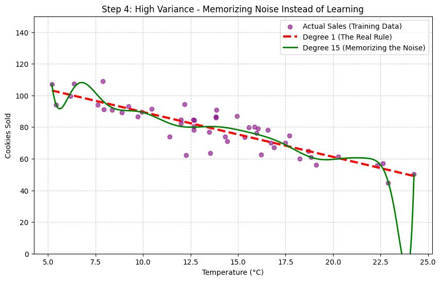

# 🥐 The Bakery Forecaster: A Pattern Analysis Pipeline

This project is a step-by-step exploration of non-parametric density estimation and regression models, built as part of the Pattern Analysis course (SS26) at FAU Erlangen-Nürnberg.

## Objective
To simulate weather and sales data, map the underlying distribution, and compare how different machine learning models handle uncertainty and complexity.

## Core Concepts Explored
1. **Data Generation:** Creating a synthetic, correlated dataset with added Gaussian noise.
2. **Density Estimation:** Visualizing the data using Histograms to understand the Model Selection Problem.
3. **Linear Regression:** Using maximum likelihood to find the "best fit" hyperplane.
4. **The Bias-Variance Tradeoff:** Demonstrating "overfitting" by tuning hyperparameters (a Degree 15 polynomial) directly on training data, causing the model to memorize noise.
5. **Bayesian Linear Regression:** Applying a prior belief and updating it with data to create a posterior distribution, visually representing uncertainty.

## How to Run This Project
1. Clone the repository to your local machine.
2. Open a terminal inside the project folder and create a virtual environment:
   `python -m venv venv`
3. Activate the environment:
   * Windows: `.\venv\Scripts\activate`
   * Mac/Linux: `source venv/bin/activate`
4. Install the required libraries:
   `pip install -r requirements.txt`
5. Open the Jupyter Notebook:
   `jupyter notebook density_forecaster.ipynb`

## Visual Results
### The Bias-Variance Tradeoff
Here we can see what happens when we use a model that is too complex (Degree 15) versus a simple model (Degree 1). The complex model memorizes the noise!

### Embracing Uncertainty (Bayesian Regression)
By using a weak prior, we allow the model to show us a distribution of possible answers. The red fan shows exactly where the model lacks confidence due to sparse data.
